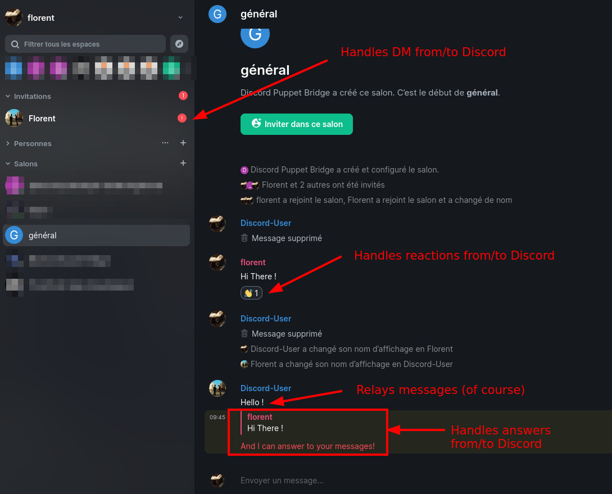

<!--
NOTA: Este README foi creado automáticamente por <https://github.com/YunoHost/apps/tree/master/tools/readme_generator>
NON debe editarse manualmente.
-->

# Matrix-Discord bridge para YunoHost

[](https://dash.yunohost.org/appci/app/matrix-puppet-discord)  

[](https://install-app.yunohost.org/?app=matrix-puppet-discord)

*[Le este README en outros idiomas.](./ALL_README.md)*

> *Este paquete permíteche instalar Matrix-Discord bridge de xeito rápido e doado nun servidor YunoHost.*  
> *Se non usas YunoHost, le a [documentación](https://yunohost.org/install) para saber como instalalo.*

## Vista xeral

This is a discord puppeting bridge for matrix. It handles bridging private and group DMs, as well as Guilds (servers). It is based on [mx-puppet-bridge](https://gitlab.com/mx-puppet/mx-puppet-bridge).

### Features

- Direct (1:1) Chats
- DM Group Chats
- Plain Text
- Formatted Messages
- Media/files
- Redactions/Deletions
- Presence (Discord → Matrix only)
- Typing notifications (Discord → Matrix only)
- Replies
- Edits
- Reactions
- Stickers
- Multi-user
- Friends management
- Initiate chats from matrix

### How to

See <https://gitlab.com/mx-puppet/discord/mx-puppet-discord> for documentation.


**Versión proporcionada:** 0.1.7~ynh5

## Capturas de pantalla



## :red_circle: Caraterísticas cuestionables

- **Upstream not maintained**: This software is not maintained anymore. Expect it to break down over time, be exposed to unfixed security breaches, etc.

## Documentación e recursos

- Documentación oficial para admin: <https://gitlab.com/mx-puppet/discord/mx-puppet-discord>
- Repositorio de orixe do código: <https://gitlab.com/mx-puppet/discord/mx-puppet-discord>
- Tenda YunoHost: <https://apps.yunohost.org/app/matrix-puppet-discord>
- Informar dun problema: <https://github.com/YunoHost-Apps/matrix-puppet-discord_ynh/issues>

## Info de desenvolvemento

Envía a túa colaboración á [rama `testing`](https://github.com/YunoHost-Apps/matrix-puppet-discord_ynh/tree/testing).

Para probar a rama `testing`, procede deste xeito:

```bash
sudo yunohost app install https://github.com/YunoHost-Apps/matrix-puppet-discord_ynh/tree/testing --debug
ou
sudo yunohost app upgrade matrix-puppet-discord -u https://github.com/YunoHost-Apps/matrix-puppet-discord_ynh/tree/testing --debug
```

**Máis info sobre o empaquetado da app:** <https://yunohost.org/packaging_apps>
